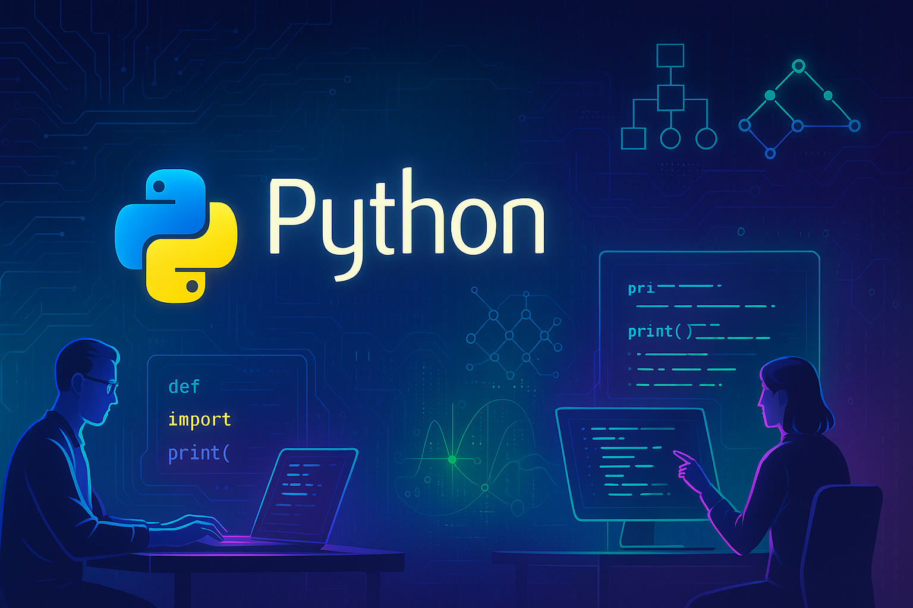

# 🐍 Python Repository

Welcome to my Python repository — a space where I experiment, automate, analyze, and build intelligent solutions using one of the most versatile programming languages. From AI/ML to web development and automation scripts, you’ll find powerful logic written in clean, elegant Python.

---


---

## 🧠 Tech Stack

- **Language:** Python 3.x  
- **Libraries/Frameworks:** NumPy, Pandas, Flask, Django, OpenCV, Scikit-learn, TensorFlow, Matplotlib  
- **Tools Used:** VS Code, Jupyter Notebook, PyCharm  
- **Focus Areas:** AI/ML, web dev, automation, data analysis, scripting

---

## 📌 How to Use

1. Clone this repository:
   ```bash
   git clone https://github.com/AmulyaInnovates/Python.git
2. Open any .py file in your preferred IDE or text editor.
3. Run the script and explore the logic behind the scenes!

---

## 🤝 Collaboration & Connection

Whether you’re solving real-world problems with Python, exploring automation or machine learning, or building powerful tools — I’d love to collaborate.

- 💬 Open to feedback, suggestions, and improvements
- 🤝 Happy to pair up on cool Python projects
- ⚙️ Let's share innovative scripts and ideas!

---

## 📬 Contact

-📧 Email: amulya.gupta.2556@gdgoenkarohini.edu.in
-🐙 GitHub: AmulyaInnovates

---

> *Thanks for stopping by — Let’s turn ideas into programs!*
